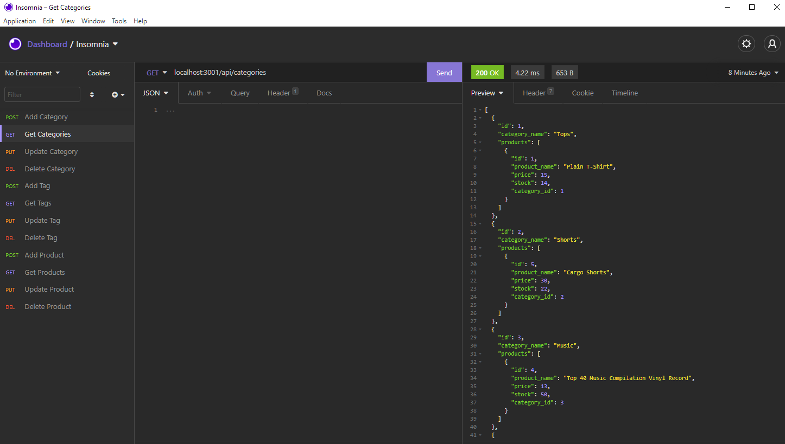

# EcomBackEnd

## Description

A backend database setup for a commerical website to view and maintain inventory by way of categories, products, and tags. This does not have a front end, but you can acess the database through programs like Insomnia or Postman, as shown in the walkthru video.
    
## https://github.com/lancebailey26/EcomBackEnd

## Installation

install all required packages via "npm install" in your terminal, then make use of the MySql database by running the schema and seed files.

## Usage

Use a program like Insomnia to produce all relevant CRUD (create read update delete) functionalities.

## Credits

n/a

## Copyright Lance Bailey 8/2/2021 License: MIT License